# ⚡️ FLASH: A framework for Federated Learning with Attribute Selection and Hyperparameter optimization
## Best student paper award FLTA IEEE 2025, In proceedings
### Ioannis Christofilogiannis, Georgios Valavanis, Alexander Shevtsov, Ioannis Lamprou and Sotiris Ioannidis

Welcome to FLASH! This guide will help you run federated learning experiments with feature selection and hyperparameter optimization across distributed clients. Whether you're experimenting with different models, testing feature selection methods, or deploying at scale, we've got you covered.

**IEEE Style:**
> I. Christofilogiannis, G. Valavanis, A. Shevtsov, I. Lamprou and S. Ioannidis, "FLASH: A Framework for Federated Learning with Attribute Selection and Hyperparameter Optimization," 2025 3rd International Conference on Federated Learning Technologies and Applications (FLTA), Dubrovnik, Croatia, 2025, pp. 93-100, doi: 10.1109/FLTA67013.2025.11336571.

**BibTeX:**
```bibtex
@INPROCEEDINGS{11336571,
  author={Christofilogiannis, Ioannis and Valavanis, Georgios and Shevtsov, Alexander and Lamprou, Ioannis and Ioannidis, Sotiris},
  booktitle={2025 3rd International Conference on Federated Learning Technologies and Applications (FLTA)}, 
  title={FLASH: A Framework for Federated Learning with Attribute Selection and Hyperparameter Optimization}, 
  year={2025},
  pages={93-100},
  doi={10.1109/FLTA67013.2025.11336571}
}
```

## 📋 Table of Contents

- [Quick Start](#-quick-start)
- [Core Technologies](#-core-technologies)
- [Understanding FLASH](#-understanding-flash)
- [Three Ways to Run](#-three-ways-to-run)
- [Detailed Guides](#-detailed-guides)
- [Technical Reference](#-technical-reference)
- [Troubleshooting](#-troubleshooting)
- [References](#-references)

## 🎯 Quick Start

Get up and running in 3 simple steps:

```bash
# 1. Download and prepare datasets
./download_datasets.sh
python3 unified-data-splitter.py

# 2. Install dependencies
pip install -r requirements

# 3. Run your first experiment!
python3 runner.py
```

That's it! Your federated learning experiment is now running. 🎉

## 🔧 Core Technologies

FLASH is built using a hybrid architecture that combines:

- **Python & Cython** [16]: Leverages Python's ML ecosystem while utilizing C++'s system-level performance through Cython
- **scikit-learn** [18]: Provides machine learning models (GNB, SGDC, MLPC, Logistic Regression)
- **Docker** [17]: Enables scalable and reproducible deployment in distributed environments
- **Cryptography** [19]: Implements AES and RSA encryption for secure parameter transmission

## 🧠 Understanding FLASH

### What is Federated Learning?

Imagine multiple hospitals wanting to train a shared medical diagnosis model without sharing sensitive patient data. That's federated learning! Each hospital (client) trains locally on its own data, then shares only model updates with a central server [2].

In FLASH, clients work with **different partitions of the same dataset**. The data is split across clients to simulate a distributed learning environment where each client has access to only a subset of the complete data.


### Why Feature Selection?

Not all features are equally important! FLASH uses intelligent feature selection to:
- 🎯 **Improve accuracy** by focusing on relevant features
- ⚡ **Speed up training** by reducing dimensionality
- 💰 **Save bandwidth** in distributed settings
<!-- - 🔒 **Enhance privacy** by using fewer features -->

## Understanding Feature Election


## Feature Election Process

Feature Election is FLASH's collaborative approach to feature selection across clients:


**Feature Election Algorithm Explained:**

The algorithm works in three steps to balance consensus and diversity:

1. **Intersection Features** (Always Included)
   - Features selected by ALL clients
   - Unanimously voted

2. **Difference Set** (Freedom Rate Applied)
   - Features in union but NOT in intersection

3. **Freedom Rate Selection**
   ```
   If freedom_rate = 0.0:  Keep only intersection (most conservative)
   If freedom_rate = 0.33:  Keep intersection + 33% of difference set
   If freedom_rate = 0.5:  Keep intersection + 50% of difference set
   If freedom_rate = 1.0:  Keep entire union (most aggressive)
   ```

**Visual Explanation:**

The diagram below illustrates how the freedom degree parameter controls feature selection across three clients:


- **Left (fd=0)**: Only features selected by ALL clients (intersection) - most conservative
- **Center (fd=0.4)**: Intersection + top 40% of features selected by at least one client - balanced approach
- **Right (fd=1)**: All features selected by ANY client (union) - most aggressive

In the center example with fd=0.4:
- Feature f1 is in the intersection (selected by all 3 clients) → always included
- Features f2, f3, f4 are in the union but not intersection (selected by 1-2 clients)
- With fd=0.4, we select the top 40% of {f2, f3, f4} based on weighted preference scores
- If f2 and f3 have higher scores than f4, final selection: {f1, f2, f3}

**Weighted vs Unweighted:**
- **Weighted** (`--fe_weighted`): Clients with more samples have more influence on feature scores
- **Unweighted**: All clients have equal influence regardless of data size

### Key Concepts

**Freedom Rate**: Controls how many features to keep from the union of client-selected features that aren't in the intersection (e.g., 0.3 = keep 30% of non-overlapping features plus all intersection features)

**Feature Selection Methods**:
- `none`: Use all features (baseline)
- `lasso`: L1-regularization based selection [22]
- `impetus`: PyImpetus - Predictive Permutation Feature Selection (PPFS) [24]
- `elastic_net`: Elastic Net regularization
- `sequential`: Sequential Attention Optimizer [23]

**Weighted Aggregation**: 
- **Feature Selection**: Clients with more data samples have more influence on feature selection
- **Model Aggregation**: Model parameters are weighted by the number of training samples per client [20]

**FedProx**: An alternative aggregation algorithm that adds a proximal term to handle heterogeneous data [21]. The `mu` parameter controls the strength of this regularization.


#### Federated Hyperparameter Optimization (HPO)

FLASH includes a collaborative hyperparameter tuning process using Random Search [9]:


**HPO Key Features:**

1. **Stratified K-Fold**: Maintains class distribution in each fold
2. **Weighted Voting**: Clients with more samples have more influence on final selection
3. **Federated Validation**: Each fold involves aggregation, simulating real FL conditions
4. **Scalability**: Limits maximum models tested per client (default: 500)

**When to Use HPO:**
- ✅ When you want to find the best configuration automatically
- ✅ For models like SGDC and MLPC that have many tunable parameters
- ❌ Skip for quick experiments (adds significant computation time)
- ❌ Not much use for GNB (one hyperparameter)

## 3️⃣ Three Ways to Run

Choose your adventure based on your needs:


### Method 1: Runner Script 🏃

**Best for**: Quick experiments, testing multiple configurations

**Pros**: 
- One command runs everything
- Automatic result comparison
- Perfect for hyperparameter sweeps

**Example**:
```bash
python3 runner.py \
    --dataset-clients heartdisease:3 mushroom:2 \
    --models GNB SGDC \
    --fs-methods impetus lasso \
    --freedom-rates 0.3 0.5 0.7
```

This runs experiments with 3 clients on heartdisease dataset and 2 clients on mushroom dataset.

### Method 2: Manual Server-Client 🛠️

**Best for**: Development, debugging, understanding internals

**Pros**: 
- Complete control over each component
- Each terminal simulates a system
- See real-time interactions

**Example**:
```bash
# Terminal 1: Start server
python3 server.py \
    --port 8080 \
    --clients 2 \
    --model GNB

# Terminal 2: Start client 1 (loads income_client_0 partition)
python3 client.py \
    --ip 127.0.0.1 \
    --port 8080 \
    --dataset income

# Terminal 3: Start client 2 (loads income_client_1 partition)
python3 client.py \
    --ip 127.0.0.1 \
    --port 8080 \
    --dataset income
```

### Method 3: Docker Compose 🐳

**Best for**: Production deployment, reproducible experiments in isolated environments


**Example**:
```bash
docker-compose up --scale client=5
```

## 📚 Detailed Guides

### Runner Script Deep Dive

The runner script is your Swiss Army knife for federated learning experiments.

#### Basic Usage

```bash
# Minimal experiment
python3 runner.py

# Custom datasets and models
python3 runner.py \
    --dataset-clients heartdisease:3 \
    --models GNB \
    --fs-methods impetus
```

#### Hyperparameter Tuning

Want to find the best configuration? Use tuning mode:

```bash
python3 runner.py \
    --tuning \
    --combs 5 \
    --dataset-clients income:3 \
    --models SGDC MLPC \
    --fs-methods lasso impetus
```

This will test 5 random combinations and help you identify winners!

#### Running Specific Experiments

Create `combinations.json`:
```json
[
    {
        "dataset": "heartdisease",
        "model": "GNB",
        "fs_method": "impetus",
        "freedom_rate": 0.5,
        "weighted": true
    },
    {
        "dataset": "mushroom",
        "model": "SGDC",
        "fs_method": "lasso",
        "freedom_rate": 0.7,
        "weighted": false
    }
]
```

Run it:
```bash
python3 runner.py --specific-combinations --combinations-file combinations.json
```

#### Understanding Results

Your results will be organized like this:

```
backup/runner/fs_experiments_<timestamp>/
├── 📊 best_results_by_config.json      # Top performers
├── 📝 best_results_summary.txt         # Human-readable summary
├── ⚙️ experiment_configs.txt           # What you ran
└── 📈 experiments_summary.json         # All results
```

### Manual Execution Deep Dive

Perfect for when you want to understand what's happening under the hood.

#### Complete System Flow

Here's the complete federated learning process from start to finish:


#### Step-by-Step Setup

**Step 1**: Prepare the environment
```bash
# Compile Cython components (one-time setup)
python3 setup.py build_ext --inplace

# Prepare your datasets
python3 unified-data-splitter.py
```

**Step 2**: Start the server
```bash
python3 server.py \
    --port 8080 \
    --clients 3 \
    --model SGDC \
    --fe-method impetus \
    --fe_weighted \
    --freedom 0.5
```

**Step 3**: Launch clients (each in a separate terminal)
```bash
# All clients use the same dataset (different partitions)
# Client 0 will automatically load: heartdisease_client_0_train.csv and heartdisease_client_0_test.csv
python3 client.py \
    --ip 127.0.0.1 \
    --port 8080 \
    --dataset heartdisease

# Client 1 will automatically load: heartdisease_client_1_train.csv and heartdisease_client_1_test.csv
python3 client.py \
    --ip 127.0.0.1 \
    --port 8080 \
    --dataset heartdisease

# Client 2 will automatically load: heartdisease_client_2_train.csv and heartdisease_client_2_test.csv
python3 client.py \
    --ip 127.0.0.1 \
    --port 8080 \
    --dataset heartdisease
```

**Note:** 
- The server dictates the model and feature selection method
- All clients use the **same dataset name**, but each loads its own partition
- Client IDs are automatically assigned (0, 1, 2, ...) based on connection order

#### Common Scenarios

**Scenario 1: Testing Feature Selection Impact**
```bash
# Server with feature selection
python3 server.py \
    --port 8080 \
    --clients 2 \
    --model SGDC \
    --fe-method lasso \
    --fe_weighted \
    --freedom 0.7

# Both clients use the same dataset (different partitions)
python3 client.py --ip 127.0.0.1 --port 8080 --dataset income
python3 client.py --ip 127.0.0.1 --port 8080 --dataset income
```

**Scenario 2: Using FedProx Aggregation**
```bash
# Server with FedProx
python3 server.py \
    --port 8080 \
    --clients 3 \
    --model MLPC \
    --fedprox \
    --mu 0.05

# All clients use mushroom dataset (partitions 0, 1, 2)
python3 client.py --ip 127.0.0.1 --port 8080 --dataset mushroom
python3 client.py --ip 127.0.0.1 --port 8080 --dataset mushroom
python3 client.py --ip 127.0.0.1 --port 8080 --dataset mushroom
```

**Scenario 3: Hyperparameter Tuning**
```bash
# Server with tuning enabled
python3 server.py \
    --port 8080 \
    --clients 2 \
    --model SGDC \
    --tuning \
    --k_folds 5 \
    --combs 10 \
    --ml_mode w

# Both clients use heartdisease dataset (different partitions)
python3 client.py --ip 127.0.0.1 --port 8080 --dataset heartdisease
python3 client.py --ip 127.0.0.1 --port 8080 --dataset heartdisease
```

### Docker Compose Deep Dive

Great for production and reproducible research.

#### Container Architecture

```mermaid
graph TB
    subgraph Docker Environment
        Server[🖥️ Server Container<br/>Port 8080]
        Client1[👤 Client Container 1]
        Client2[👤 Client Container 2]
        Client3[👤 Client Container 3]
        
        Server -.Network.-> Client1
        Server -.Network.-> Client2
        Server -.Network.-> Client3
    end
    
    subgraph Host Machine
        Datasets[📁 datasets/]
        Data[📁 data/]
        Logs[📁 logs/]
    end
    
    Datasets -->|Read-Only| Server
    Datasets -->|Read-Only| Client1
    Datasets -->|Read-Only| Client2
    Datasets -->|Read-Only| Client3
    
    Server -->|Write| Data
    Server -->|Write| Logs
    Client1 -->|Write| Logs
    
    style Server fill:#4CAF50,stroke:#2E7D32,color:#fff
    style Client1 fill:#2196F3,stroke:#1565C0,color:#fff
    style Client2 fill:#2196F3,stroke:#1565C0,color:#fff
    style Client3 fill:#2196F3,stroke:#1565C0,color:#fff
```



#### Quick Start

```bash
# Basic 3-client setup
docker-compose up --scale client=3

# Custom configuration
EXPERIMENT_TIME=$(date +%Y%m%d_%H%M%S) \
NUM_CLIENTS=5 \
MODEL=SGDC \
FS_METHOD=impetus \
FREEDOM_RATE=0.7 \
DATASET=mushroom \
docker-compose up --scale client=5

# Cleanup
docker-compose down
```

#### Advanced Scenarios

**Large-Scale Experiment**:
```bash
EXPERIMENT_TIME=$(date +%Y%m%d_%H%M%S) \
NUM_CLIENTS=10 \
MODEL=MLPC \
FS_METHOD=lasso \
FREEDOM_RATE=0.5 \
DATASET=income \
docker-compose up --scale client=10
```

**Production Deployment**:
```bash
# Run in detached mode
docker-compose up -d --scale client=5

# Monitor logs
docker-compose logs -f server

# Stop gracefully
docker-compose down
```

## 🔧 Technical Reference

### Available Datasets
- `heartdisease`: Medical diagnosis (400k samples, 18 features) [38]
- `income`: Census income prediction (48,842 samples, 14 features) [37]
- `mushroom`: Mushroom toxicity classification (8,124 samples, 22 features) [36]
- `breast_cancer`: Wisconsin Diagnostic Breast Cancer (569 samples, 30 features) [39]


### Supported Models
- `GNB`: Gaussian Naive Bayes (fast, interpretable) [18]
- `SGDC`: Stochastic Gradient Descent Classifier (scalable, supports partial_fit) [18]
- `MLPC`: Multi-Layer Perceptron Classifier (powerful, deep learning) [18]
- `LogReg`: Logistic Regression (linear, interpretable) [18]


### Feature Selection Methods
- `none`: Use all features (baseline)
- `lasso`: L1-regularization based selection [22]
- `impetus`: PyImpetus - Predictive Permutation Feature Selection (PPFS) [24]
- `elastic_net`: Elastic Net regularization
- `sequential`: Sequential Attention Optimizer [23]

### Server Parameters

**Required:**
```bash
--port          # Server port number (required)
--dataset       # Dataset to use (required)
```

**Connection:**
```bash
--ip            # Server IP address
--host          # Server hostname (alternative to --ip)
```

**Note:** Client receives model, feature selection method, and other parameters from the server during initialization.

### Runner Parameters
```bash
--dataset-clients        # Dataset:num_clients pairs (e.g., heartdisease:3 mushroom:2)
--models                 # Models to test (GNB, SGDC, MLPC, LogReg)
--fs-methods            # Feature selection methods (impetus, lasso, elastic_net, sequential, none)
--freedom-rates         # Freedom rate values (e.g., 0.3 0.5 0.7)
--tuning                # Enable hyperparameter tuning (flag)
--combs                 # Number of combinations for tuning (default: 1)
--specific-combinations # Use specific configurations from JSON file (flag)
--combinations-file     # JSON file with configurations (default: combinations.json)
--base-port            # Starting port number (default: 8080)
--weighted              # Use weighted feature aggregation (flag)
--fedprox               # Use FedProx aggregation (flag)
--mu                    # FedProx proximal term strength (default: 0.01)
```

## 🐛 Troubleshooting

### Common Issues

**Port Already in Use**
```bash
# Runner script
python3 runner.py --base-port 9090

# Manual server
python3 server.py --port 9090
```

**Docker Issues**
```bash
# Full cleanup
docker-compose down
docker system prune -a

# Check logs
docker-compose logs server
docker-compose logs client

# Rebuild images
docker-compose build --no-cache
```

**Client Connection Timeout**
- Ensure server is running first
- Check firewall settings
- Verify IP and port are correct
- Make sure the number of clients matches server expectation

**Dataset Not Found**
```bash
# Error: Provided dataset folder is not empty or not exists
# Solution: Ensure datasets are in the correct location and properly partitioned
ls datasets/heartdisease_federated/
# Should show files like: heartdisease_client_0_train.csv, heartdisease_client_0_test.csv, 
#                         heartdisease_client_1_train.csv, heartdisease_client_1_test.csv, etc.

# Run dataset preparation if needed
./download_datasets.sh
python3 unified-data-splitter.py
```

**Client/Server Mismatch**
- Ensure the number of client partitions matches the `--clients` parameter on the server
- If server expects 3 clients, you need: dataset_client_0, dataset_client_1, dataset_client_2 files
- All clients should use the **same dataset name** (e.g., all use `--dataset heartdisease`)

**Import Errors**
```bash
# Reinstall dependencies
pip install -r requirements --force-reinstall

# Recompile Cython
python3 setup.py build_ext --inplace --force
```

**Model Configuration Errors**
- Remember: Server dictates the model type, not the client
- Supported models: GNB, SGDC, MLPC, LogReg (case-sensitive)
- Feature selection methods: impetus, lasso, elastic_net, sequential, none

### Getting Help

- 📧 Check the logs in `logs/` directory
- 🐛 Server logs are in `logs/run_server/`
- 🐛 Client logs are in `logs/client{N}/`
- 📊 Review experiment outputs in `backup/runner/` (for runner script)
- 💬 Check configuration files: `server_config.json` in experiment directory

## 🎓 Tips & Best Practices

1. **Start Small**: Begin with 2-3 clients before scaling up
2. **Monitor Resources**: Keep an eye on CPU/memory usage, especially with MLPC
3. **Compare Baselines**: Always run experiments with `--fe-method none` for comparison
4. **Document Experiments**: The runner script saves configs automatically in experiment directories
5. **Use Docker for Reproducibility**: Same results across different machines
6. **Server Controls Configuration**: Remember that the server dictates the model and feature selection method
7. **Dataset Preparation**: Ensure datasets are properly split into partitions - all clients use the same dataset name but different partition files
8. **Hyperparameter Tuning**: Use k-folds ≥ 3 for reliable cross-validation results
9. **Feature Selection Trade-offs**: Lower freedom rates are more conservative; higher rates are more aggressive
10. **FedProx for Heterogeneity**: Use FedProx (`--fedprox`) when clients have very different data distributions
11. **Client Partitions**: The number of `dataset_client_N` files must match the `--clients` parameter on the server

---

## 📚 References

For complete academic references and citations, please refer to the FLASH research paper. Key references used in this framework include:

### Federated Learning
- **[2]** McMahan, H. B., Moore, E., Ramage, D., Hampson, S., & Aguera y Arcas, B. (2017). Communication-efficient learning of deep networks from decentralized data. In *Proceedings of the 20th International Conference on Artificial Intelligence and Statistics (AISTATS)*, pp. 1273-1282.
- **[20]** McMahan, H. B., Moore, E., Ramage, D., & Aguera y Arcas, B. (2016). Federated learning of deep networks using model averaging. *CoRR*, abs/1602.05629. Available: http://arxiv.org/abs/1602.05629

### Aggregation Algorithms
- **[21]** Li, T., Sahu, A. K., Zaheer, M., Sanjabi, M., Talwalkar, A., & Smith, V. (2020). Federated optimization in heterogeneous networks. arXiv:1812.06127. Available: https://arxiv.org/abs/1812.06127

### Feature Selection Methods
- **[22]** Tibshirani, R. (1996). Regression shrinkage and selection via the lasso. *Journal of the Royal Statistical Society: Series B (Methodological)*, 58(1), 267-288.
- **[23]** Yasuda, T., Bateni, M., Chen, L., Fahrbach, M., Fu, G., & Mirrokni, V. (2023). Sequential attention for feature selection. arXiv:2209.14881. Available: https://arxiv.org/abs/2209.14881
- **[24]** Hassan, A., Paik, J. H., Khare, S. R., & Hassan, S. A. (2025). A wrapper feature selection approach using markov blankets. *Pattern Recognition*, 158, 111069. Available: https://www.sciencedirect.com/science/article/pii/S0031320324008203

### Hyperparameter Optimization
- **[9]** Bergstra, J., & Bengio, Y. (2012). Random search for hyper-parameter optimization. *Journal of Machine Learning Research*, 13(2).
- **[25]** Akiba, T., Sano, S., Yanase, T., Ohta, T., & Koyama, M. (2019). Optuna: A next-generation hyperparameter optimization framework. In *The 25th ACM SIGKDD International Conference on Knowledge Discovery & Data Mining*, pp. 2623-2631.

### Machine Learning Libraries and Tools
- **[16]** Behnel, S., Bradshaw, R., Citro, C., Dalcin, L., Seljebotn, D. S., & Smith, K. (2011). Cython: The best of both worlds. *Computing in Science & Engineering*, 13(2), 31-39.
- **[17]** Docker Inc. & Python Software Foundation (2024). Python 3.12 slim bullseye docker image. Docker Hub. Available: https://hub.docker.com/_/python
- **[18]** Pedregosa, F., Varoquaux, G., Gramfort, A., Michel, V., Thirion, B., Grisel, O., Blondel, M., Prettenhofer, P., Weiss, R., Dubourg, V., et al. (2011). Scikit-learn: Machine learning in Python. *Journal of Machine Learning Research*, 12, 2825-2830.
- **[19]** Python Cryptographic Authority (2025). cryptography: Python cryptographic library. Available: https://cryptography.io/en/latest/

### Datasets
- **[36]** UCI Machine Learning Repository (1981). Mushroom Dataset. DOI: https://doi.org/10.24432/C5959T
- **[37]** Becker, B., & Kohavi, R. (1996). Adult. *UCI Machine Learning Repository*. DOI: https://doi.org/10.24432/C5XW20
- **[38]** Pytlak, K. (2022). Personal key indicators of heart disease. Kaggle. Available: https://www.kaggle.com/datasets/kamilpytlak/personal-key-indicators-of-heart-disease
- **[39]** Wolberg, W., Mangasarian, O., Street, N., & Street, W. (1993). Breast Cancer Wisconsin (Diagnostic). *UCI Machine Learning Repository*. DOI: https://doi.org/10.24432/C5DW2B

### Related Federated Learning Frameworks
- **[13]** Beutel, D. J., Topal, T., Mathur, A., Qiu, X., Fernandez-Marques, J., Gao, Y., Sani, L., Li, K. H., Parcollet, T., de Gusmão, P. P. B., & Lane, N. D. (2022). Flower: A friendly federated learning research framework. arXiv:2007.14390. Available: https://arxiv.org/abs/2007.14390
- **[14]** He, C., Li, S., So, J., Zeng, X., Zhang, M., Wang, H., Wang, X., Vepakomma, P., Singh, A., Qiu, H., Zhu, X., Wang, J., Shen, L., Zhao, P., Kang, Y., Liu, Y., Raskar, R., Yang, Q., Annavaram, M., & Avestimehr, S. (2020). FedML: A research library and benchmark for federated machine learning. arXiv:2007.13518. Available: https://arxiv.org/abs/2007.13518
- **[27]** Roth, H. R., Cheng, Y., Wen, Y., Yang, I., Xu, Z., Hsieh, Y.-T., Kersten, K., Harouni, A., Zhao, C., Lu, K., Zhang, Z., Li, W., Myronenko, A., Yang, D., Yang, S., Rieke, N., Quraini, A., Chen, C., Xu, D., Ma, N., Dogra, P., Flores, M., & Feng, A. (2022). NVIDIA FLARE: Federated learning from simulation to real-world. arXiv:2210.13291. Available: https://arxiv.org/abs/2210.13291
- **[15]** Ingerman, A., & Ostrowski, K. (2019). TensorFlow Federated. In *Proceedings of the 2nd SysML Conference*. Available: https://www.tensorflow.org/federated

---

## 📖 Full Bibliography

For a complete list of references and detailed citations, please consult the FLASH research paper. This README includes the most relevant citations for understanding the framework.

## 🔗 Additional Resources

- **FLASH Source Code**: /src/
- **Research Paper**: [Will be linked upon publication]
- **Issue Tracker**: [TODO]

---

## 📄 License

Copyright 2025 Ioannis Christofilogiannis, Georgios Valavanis, Alexander Shevtsov, Ioannis Lamprou, and Sotiris Ioannidis

This project is licensed under the Apache License 2.0 - see the [LICENSE](LICENSE-2.0.txt) file for details.

## 🙏 Acknowledgments

This research is funded by the European Commission (Horizon Europe Programme), under the project SYNAPSE (Grant Agreement No. 101120853).

---

**Note**: This framework is part of ongoing research. For questions, contributions, or collaboration opportunities, please refer to: ichristofilogian@tuc.gr for Feature Election, FLASH architecture and gvalavanis@tuc.gr for Hyperparameter Optimization.

**Last Updated**: 20/10/2025

**Version**: 1.0 (Research Preview)